# ROS CUDA door recognizer
This is a ROS package that's able to recognize doors using image processing methods. It's goal is to analyze in real time the frame captured by a camera connected to the robot in order to find a door. The algorithms are implemented to run in CPU and also in GPU, to improve the performance.

**NB:** the code is written in CUDA C, so is necessary a NVIDIA GPU

This package offers three different ros node:

* **test_performance**: this node applies the entire algorithm on a single image or a single frame captured by the camera. It can be used to evaluate the performance about the CPU and GPU algorithms. Moreover it is useful to execute test on your GPU to set at its best the parameters of the GPU algorithms.
* **door_recognizer:** this node analyzes as quickly as possible frames come by camera in order to find a door. It runs in CPU 
* **door_recognizer_gpu:** this node analyzes frames come by camera to find a door. It runs in GPU and the performance should be better than the CPU version

The goal of the last two node (that analyze as quickly as possible the frame captured by the camera) is to hide the low precision of the algorithm and its possible errors. In this way the robot can analyzes a lot of different images per second, taken in different positions and angles in order to have a lot of results to hide sporadic errors.

## Algorithmic approach

In order to detect a door, the program uses techniques of image processing. In this way some filters are applied to images captured by camera. The first step is to apply the Canny filter in order to find the edges in the image. This filter is composed by some different steps:

* **gray scale:** first of all the image is converted in gray scale. The procedure is very simple: the values of each pixel are changed with an average obtained by the old values RGB

* **Gaussian filter:** this filter is important because it prepares the image to the future manipulations. In particular this is a low-pass filter and it removes high-frequency components from the image, in order to reduce the image noise. To smooth the image, the Gaussian filter is applied by convolution to the image. The kernel (also called mask) of the Gaussian filter is a matrix. Its equation to find it is:

  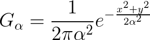  where *x*, *y* are the distance to origin.

  The problem with a 2D kernel is the high complexity, equal to O(m1 * m2 * n * n), where *m1* is the image width, *m2* is the image height and *n* is the kernel dimension. In order to reduce the complexity, a two-dimensional Gaussian filter can be applied with two single-dimensional filter, using a 1D kernel. This kernel must be applied twice, in horizontal and vertical direction, to obtain the same effects with 2D kernel. Its equation is 

  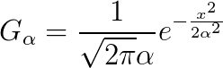 
  
  Now the complexity is O(m1 * m2 * n)
  
* **Sobel filter**: this filter is able to find edges in a image. Its implementation is divided into two steps: 

  * **calculate the derivative approximations:** to do this are applied to the image two convolution operation, using two different 3x3 masks, one for horizontal changes and one for vertical. The goal is calculate approximations of the horizontal and vertical derivatives. The results are two different matrix Gx and Gy, obtained by following: 

    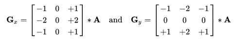

    Since the kernel is very small, it isn't necessary to split the 2D convolution in two 1D convolution as in the case of Gaussian filter, it will be slower

  * **calculate gradient approximations and gradient's direction:** at each image point, the resulting gradient approximations can be obtained by the gradient magnitude and the direction can be obtained with the arctangent of the corresponding gradient in y and x position. The following image contains these formula:

    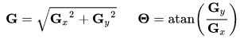

  * **non maximum suppression:** the last step of the Canny filter is to identify an accurate edge value. In fact the edges found with Sobel filter is quite blurred and this technique suppresses all gradient values except the local maximum. The algorithm is quite simple and is composed by two step:

    * compare the value of the current pixel with the value of the two adjacent pixel in the edge direction
    * if the value of the current pixel is the largest the pixel will be preserved, otherwise it will be suppressed (set to 0)
    
    After that, the pixel value will set to 255 (white) if its value is higher than a limit, otherwise it will be deleted. This final control is useful to suppress noise-derived edges. This limit is empirically determined.  
    
  
  The second step is to find the corners inside the image. In order to do this, Harris corner detector algorithm is implemented in CPU and GPU. This algorithm uses procedures similar than those used in Canny filter, they are:
  
  * **calculate the derivative approximations:** this step is the same used in Sobel filter an it produces two matrix: Gx and Gy
  
  * **compute the products of the derivatives:** the result of this step is 3 matrix, Gx^2, Gy^2, Gxy, where:  
  
    * Gxy[x]\[y] = Gx[x]\[y] * Gy[x]\[y]
    * Gx^2[x]\[y] = Gx[x]\[y] * Gx[x]\[y] 
    * Gy^2[x]\[y] = Gy[x]\[y] * Gy[x]\[y] 
  
  * **compute the sums of the products of derivatives:** for each matrix found in previous step must be applied a 2D convolution with a particular kernel: in each position there is the value 1. In other words, each pixel is the result of the sum with its neighbors
  
  * **compute the Harris response:** the last step is to calculate, for each pixel, the formula `R = det(M) - k(trace(M))^2`, where:
  
    * M is the matrix: 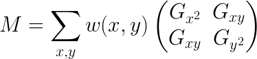
    * trace(M) =  Gx^2 + Gy^2
    * k is a constant empirically determined in interval [0.04, 0.06]
  
    Now, the pixel with a R value very high are corners 
  
  Finally are applied a particular algorithm in order to find a door starting from the filtered image. A door is found following a specific geometric model. This model consists of two horizontal lines and two vertical lines between four corners. This is the ideal geometric model but some corners of a door could be occluded. In case one of the horizontal lines must be outside the image and the previous model is wrong. In order to consider also the occluded door the geometric model is generalized by the four following assumption:
  
  1. at least two corners are visible in the image
  2. all vertical lines are included in the image
  3. vertical lines of a door must be almost perpendicular of horizontal axis of the image
  4. a door in a image must be at least a certain width and a certain height
  
  Each corner and line in a door model has a specific name as shown in following figure, this is useful for explaining future steps.
  
  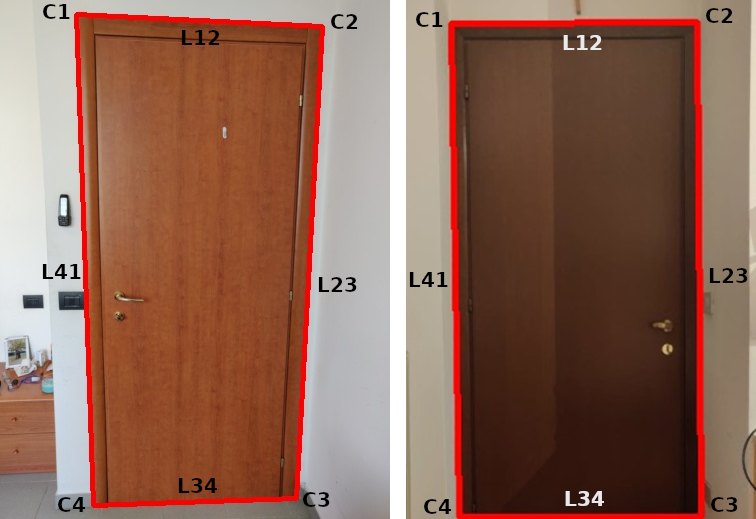
  
  The second door is occluded, in particular corners C and D are outside the image, as the line L3. In order to recognize also the occluded door the image's borders are considered edges by the Canny filter and the intersection between an image border and a door vertical lines is considered a corner by Harris Corner Detector. The algorithm steps to find recognize a door using this geometric model are the following:
  
  * **find candidate corners:** to found a door is necessary to find all four-corner groups. In practice the number of this group is too large, so found and control all groups is impossible. Ideally, only corners near a long edge could be a real door corner. In order to reduce the number of corners applying this idea, the Hough Line Transform is used. Applied to an image manipulated with Canny filter, it is able to detect straight lines. After that, every intersection between two Hough lines are found: near these points could be candidate corners to found a door. Each corner too far to the intersection between two Hough lines are suppressed
  
  * **find the candidate groups:** now is the moment to find all four-corner groups and filter them in order to preserve those that respect the geometric model. A door model is composed by four corners C1, C2, C3, C4 and four lines L12, L23, L34, L41. Every corner Ci has the coordinate (xi, yi) and every line has a certain length. Is important to specify that the origin of the axes is the top-left corner of the image and all coordinates are positive. According with the geometric model, in particular with its third and fourth assumption, the directions and lengths of this four lines can be used to get the four-corner groups that could be a real door. To doing this, two new variable are necessary:
  
    * **Sij:** the ratio between the length of Lij and the diagonal of the relative image. Sij is defined by the following equation: 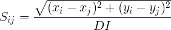 where DI is the diagonal length
    * **Dij:** the direction of Lij corresponding to the horizontal axis of the relative image. Dij is defined by the following equation: 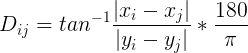
  
    Using this new variables, each four-corner groups is kept as a candidate group if it meets all of the following geometric requirements:
  
    * according with the fouth assumption of the geometric model, each line has a certain with and height. So, Sij should be in a certain range: 
  
      *heightL* < L23, L41 < *heightH*
  
      *widthL* < L12, L34 < *widthH*
  
    * L12 and L34 shuold be perpendicular with the vertical axis or, due to perspective deformation, could form a certain angle minor than 90 degrees with the vertical axis. But this angle should near 90 degrees, so: 
  
      D12, D34 > *directionH*
  
    * according with the third assumption, vertical lines of a door should be perpendicular with the horizontal axis, so they should form and angle with it near 0 degrees. In this way:
  
      D23, D41 < *directionL*
  
    * vertical lines of a door should be parallel, so:
  
      | D23 - D41 | < *parallel*
  
    * the ratio between the height and width of a door should be within a range:
  
      *ratioL* < (S23 + S41) / (S12 + S34) < *ratioH*
  
    These variables are set by default in the launch files. After that, the groups, that have most of the area overlapped with other, aren't considered
  
* **combine corners and edges:** with the previous step all the candidate groups that respect the geometric model are collected. Now is necessary to verify if there are four edges that connect the four corner. To doing this, the concept of *fill-ratio* must be defined. The four lines are impressed in the image with a mask with a thickness of 6 pixel. After that the overlap of these imaginary lines and the correspond edge found with Canny is measured. The *fill-ratio* is calculated with the following equation: 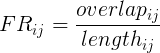 

  The four *fill-ratio* (one for each line of a door) must be larger than a threshold *ratioL* and the average of them must be larger than another threshold *ratioH*. After that, if there are more than one group, this control is repeated with two higher threshold

## Performance evaluation and profiling

In this section the algorithms implemented in CPU and GPU are compared in order to measure the speedup achieved by the parallel implementation executed in GPU. In particular are examined the procedures used to implement Canny and Harris filters. Another interesting aspect to consider is the profiling of kernels, in order to in order to collect some metrics and measure their correctness. This metrics are:

* **branch efficiency:** measures the percentage of branches that follow the main execution path. If its value is 100% the max efficiency is achieved, that means all the branches follow the same execution path
* **achieved occupancy:** this metrics is about the number of active warp. Its range of values is between 0 and 1, where 1 represent the maximum and the high efficiency
*   **global memory load efficiency:** measures the efficiency with which the kernel read data from global memory. In GPU with memory access it is possible to read 128 byte, in this way if all 32 threads in a warp require a float (4 byte), the data will be given to all threads with a single transaction. But there is some conditions for having this property: the 128 bytes must be consecutive and aligned, so the first address of the transaction must be a multiple of 128. If the threads request for data in arbitrary positions, many transaction are made (each one read 128 byte) but many read values are discarded because they are not requested by the threads. This metric is the percentage of the byte read from the memory and the byte used by the threads, so if the value is 100% the maximum efficiency is achieved
*   **global memory load efficiency:** the principle with which data is store in global memory is the same as written above. So if the value is 100% the pattern is respected and the efficiency is maximum
*   **shared memory efficiency:** this metric measures the efficiency who with threads read and write the shared memory. It's expressed in precentage

All the test are executed in a laptop with:

* CPU: Intel Core i5-8250U, 1.60 Ghz, 4 core, 8 thread
* GPU: Nvidia MX 150, 4 GB of GDDR5 memory

### Gray scale

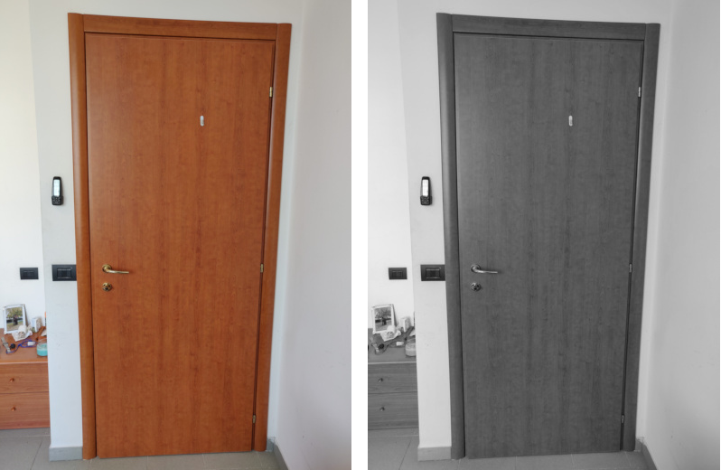

#### Image 390 x 520 pixel

Grid dimension: 300 x 1 x 1

Block dimension: 256 x 1 x 1

Performance:

* **CPU**: 0.001107 second
* **GPU**: 0.00006508 second (17 times faster)

Metrics:

* **branch efficiency:** 100%
* **achieved occupancy:** 0.907
* **global memory load efficiency:** 100%
* **global memory store efficiency:** 100%

#### Image 3456 x 4608

Grid dimension: 1024 x 1 x 1

Block dimension: 1024 x 1 x 1

Performance:

* **CPU:** 0.1159 second
* **GPU:** 0.003149 second (37 time faster)

Metrics:

- **branch efficiency:** 100%
- **achieved occupancy:** 0.924
- **global memory load efficiency:** 100%
- **global memory store efficiency:** 100%

### Gaussian Filter

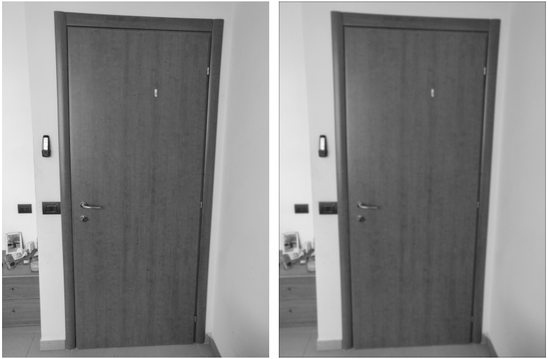

#### Image 390 x 520 pixel

Grid dimension: 300 x 1 x 1

Block dimension: 256 x 1 x 1

Performance:

- **CPU**: 0.02162 second
- **GPU**: 0.0002229 second (89 times faster)

Metrics:

- **branch efficiency:** 100%
- **achieved occupancy:** 0.931
- **global memory load efficiency:** 97.7%
- **global memory store efficiency:** 12.5%
- **shared memory efficiency:** 96.1%

#### Image 3456 x 4608

Grid dimension: 1024 x 1 x 1

Block dimension: 1024 x 1 x 1

Performance:

- **CPU:** 1.1436 second
- **GPU:** 0.05876 second (19 time faster)

Metrics:

- **branch efficiency:** 100%
- **achieved occupancy:** 0.915
- **global memory load efficiency:** 97.7%
- **global memory store efficiency:** 12.5%
- **shared memory efficiency:** 96.1%

### Sobel filter

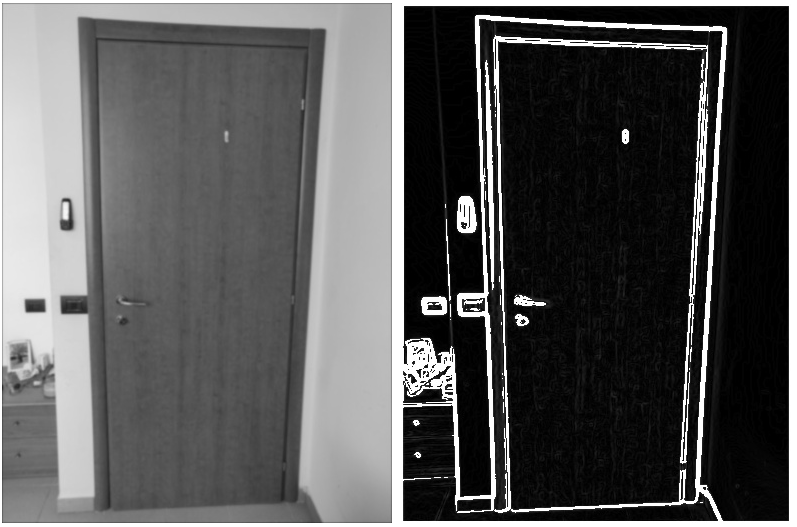

#### Image 390 x 520 pixel

2D Convolution operation (calculate the derivative approximations):

* Grid dimension: 300 x 1 x 1
* Block dimension: 256 x 1 x 1

Linear operation (calculate gradient approximations and gradient's direction):

- Grid dimension: 300 x 1 x 1
- Block dimension: 256 x 1 x 1

Performance:

- **CPU**: 0.02041 second
- **GPU**: 0.0003569 second (57 times faster)

Metrics:

* **Convolution operation:**
  * **branch efficiency:** 100%
  * **achieved occupancy:** 0.963
  * **global memory load efficiency:** 84.5%
  * **global memory store efficiency:** 100%
  * **shared memory efficiency:** 98.8%
* **Linear operation:**
  - **branch efficiency:** 89.1%
  - **achieved occupancy:** 0.901
  - **global memory load efficiency:** 100%
  - **global memory store efficiency:** 100%

#### Image 3456 x 4608

- 2D Convolution operation (calculate the derivative approximations):

  - Grid dimension: 20000 x 1 x 1
  - Block dimension: 256 x 1 x 1

  Linear operation (calculate gradient approximations and gradient's direction):

  - Grid dimension: 1024 x 1 x 1
  - Block dimension: 1024 x 1 x 1

  Performance:

  - **CPU**: 1.7694 second
  - **GPU**: 0.02980 second (59 times faster)

  Metrics:

  - **Convolution operation:**
    - **branch efficiency:** 100%
    - **achieved occupancy:** 0.842
    - **global memory load efficiency:** 98.7%
    - **global memory store efficiency:** 100%
    - **shared memory efficiency:** 99.1%
  - **Linear operation:**
    - **branch efficiency:** 89.9%
    - **achieved occupancy:** 0.899
    - **global memory load efficiency:** 100%
    - **global memory store efficiency:** 100%

  ### Non maximum suppression

  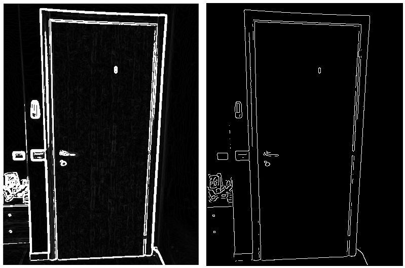

  #### Image 390 x 520 pixel

  Grid dimension: 300 x 1 x 1

  Block dimension: 256 x 1 x 1

  Performance:

  - **CPU**: 0.004035 second
  - **GPU**: 0.00009202 second (44 times faster)

  Metrics:

  - **branch efficiency:** 85.6%
  - **achieved occupancy:** 0.919
  - **global memory load efficiency:** 51.5%
  - **global memory store efficiency:** 100%

  #### Image 3456 x 4608

  Grid dimension: 1024 x 1 x 1

  Block dimension: 1024 x 1 x 1

  Performance:

  - **CPU:** 0.4129 second
  - **GPU:** 0.009663 second (43 times faster)

  Metrics:

  - **branch efficiency:** 84.4%
  - **achieved occupancy:** 0.939
  - **global memory load efficiency:** 44.5%
  - **global memory store efficiency:** 100%

### Harris corner detector

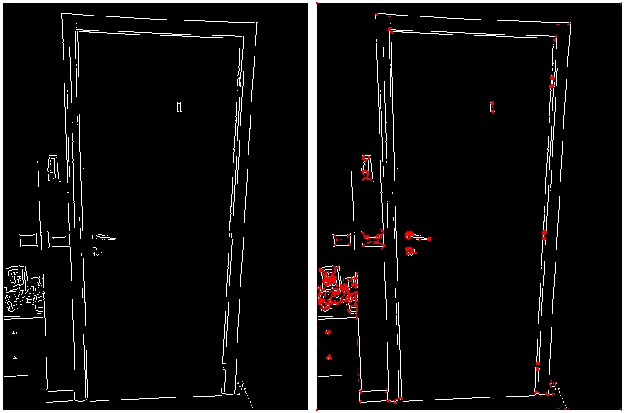

The procedures are very similar then those applied in Canny filter, so the value of the GPU metrics are not very interesting. In this case only the performance are shown.

#### Image 390 x 520 pixel

Performance:

* **CPU:** 0.01692
* **GPU:** 0.0005769 (29 times faster)